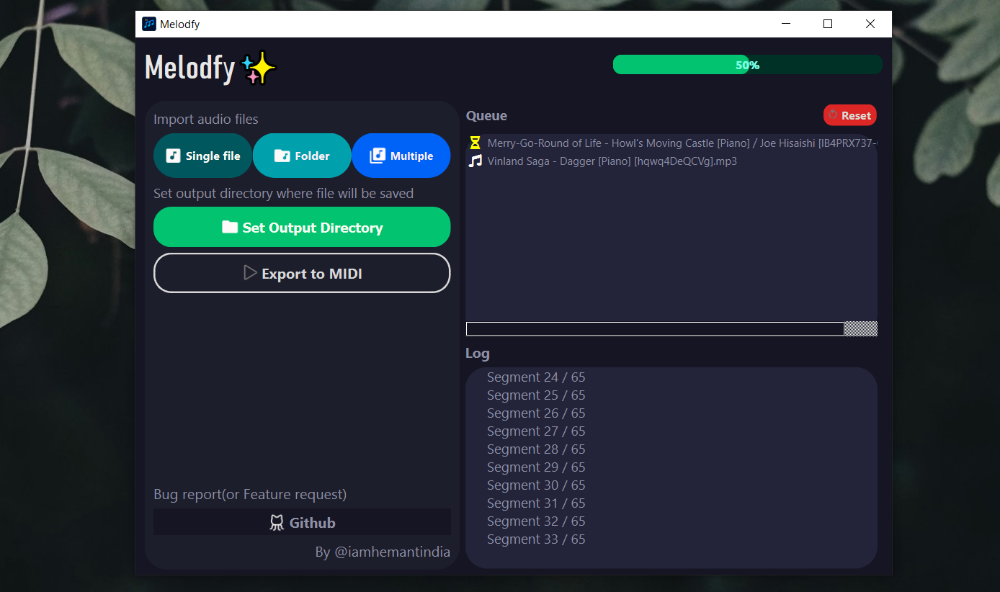
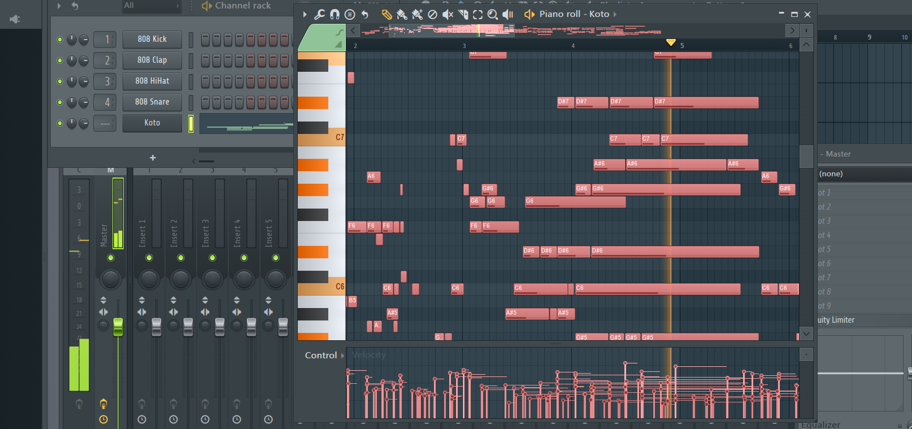

## Melodfy✨: AI-Powered Piano Audio to MIDI Converter 🎶

Melodfy is an python application that utilizes the power of artificial intelligence (developed by ByteDance) to seamlessly convert audio recordings of piano playing into playable MIDI files. 

**Features:**

* **Effortless Conversion:** Simply upload your piano audio file and Melodfy will handle the rest, transforming it into an accurate and editable MIDI file.
* **AI-Powered Accuracy:** Melodfy leverages advanced AI algorithms to ensure the highest level of precision in capturing notes, timing, and dynamics from your recordings.
* **Unleash Creativity:** Breathe new life into your piano recordings by editing and manipulating them in MIDI format using your favorite digital audio workstation (DAW).
* **Free and Open-Source:** Melodfy is released under a permissive license, allowing for free and unrestricted use, modification, and distribution for both personal and commercial purposes (with attribution).




### **Getting Started:**

1. **Clone the repository:**

```bash
git clone https://github.com/HemantKArya/Melodfy.git
```

2. **Install dependencies:**

Refer to the `requirements.txt` file for a list of required libraries and install them using your preferred package manager (e.g., `pip install -r requirements.txt`).
And make sure FFMPEG is already installed in your system and availible through 'PATH'. [Download from here(FFMPEG)](https://www.ffmpeg.org/download.html).

3. **Run the application:**

Instructions for running the application will depend on your chosen implementation (e.g., command-line script, GUI application). Refer to the provided documentation or code comments for specific instructions.

**License:**

This project is licensed under the MIT License: [https://opensource.org/licenses/MIT](https://opensource.org/licenses/MIT).

**Contributing:** (Coming Soon)

We welcome contributions from the community! Please refer to the CONTRIBUTING.md: CONTRIBUTING.md file for guidelines on how to contribute to the project.

**Credits:**

* This project is developed by Hemant Kumar which is a GUI Interface for [Piano Transcription](https://github.com/bytedance/piano_transcription)..
* Melodfy is heavely dependent on these projects -
    
    1. [Piano Transcription](https://github.com/bytedance/piano_transcription) by [ByteDance](https://github.com/bytedance)
    2. [Piano Transcription Inference](https://github.com/qiuqiangkong/piano_transcription_inference) by [qiuqiangkong](https://github.com/qiuqiangkong)
  

**Additional Information:**

* For more information, please refer to the documentation within the repository.(Uploading soon)
* Feel free to raise any issues or suggestions on the GitHub issue tracker.

